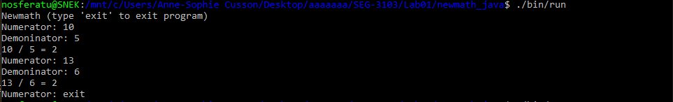
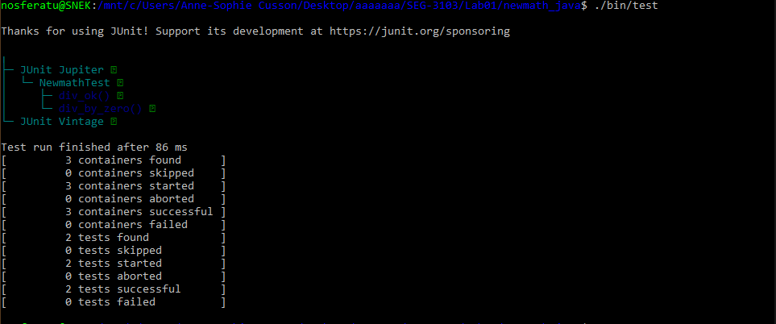
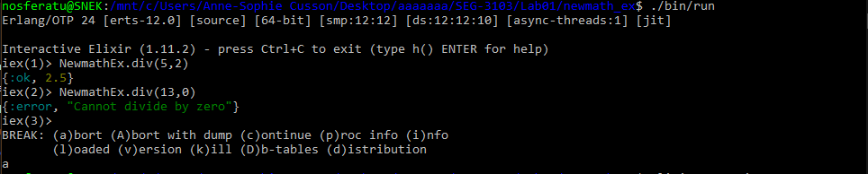
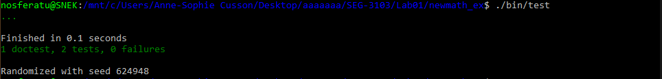

# Lab 01

| Outline | Value |
| --- | --- |
| Course | SEG 3503 |
| Date | Summer 2021 |
| Professor | Andrew Forward, aforward@uottawa.ca |
| TA | Aymen Mhamdi, amham077@uottawa.ca |
| Team | Anne-Sophie Cusson 300130176<br>Benoit Vanasse 300079464 |

## Deliverables

* [https://github.com/4nn3-50ph13/seg3103_playground/tree/main/Lab01](https://github.com/4nn3-50ph13/seg3103_playground/tree/main/Lab01)
* Shared repo above with TA and Professors

### Java

I am running Java openjdk 14

```
$ java -version
openjdk version "14.0.2" 2020-07-14
OpenJDK Runtime Environment (build 14.0.2+12-Ubuntu-120.04)
OpenJDK 64-Bit Server VM (build 14.0.2+12-Ubuntu-120.04, mixed mode, sharing)
```

To run the Java program (in `newmath_java`) in WSL 2:

```
$ ./bin/run
```

Here is an output of the running program

```
Newmath (type 'exit' to exit program)
Numerator: 10
Demoninator: 5
10 / 5 = 2
Numerator: 13
Demoninator: 6
13 / 6 = 2
Numerator: exit
```

With a screenshot from the terminal




### JUnit

I am working with JUnit 5 (via Console standalone 1.7.1)

To run JUnit in WSL 2:

```
$ ./bin/test
```

Here is the output of the tests

```
Thanks for using JUnit! Support its development at https://junit.org/sponsoring

╷
├─ JUnit Jupiter ✔
│  └─ NewmathTest ✔
│     ├─ div_ok() ✔
│     └─ div_by_zero() ✔
└─ JUnit Vintage ✔

Test run finished after 86 ms
[         3 containers found      ]
[         0 containers skipped    ]
[         3 containers started    ]
[         0 containers aborted    ]
[         3 containers successful ]
[         0 containers failed     ]
[         2 tests found           ]
[         0 tests skipped         ]
[         2 tests started         ]
[         0 tests aborted         ]
[         2 tests successful      ]
[         0 tests failed          ]
```

With a screenshot from the terminal




### Elixir

I am running Elixir 11.2 with Erlang 23

```
$ elixir --version
Erlang/OTP 24 [erts-12.0] [source] [64-bit] [smp:12:12] [ds:12:12:10] [async-threads:1] [jit]

Elixir 1.11.2 (compiled with Erlang/OTP 23)
```

To run the Elixir program (in `newmath_ex`) in WSL 2:

```
$ ./bin/run
```

Here is an output of the running program

```elixir
Erlang/OTP 24 [erts-12.0] [source] [64-bit] [smp:12:12] [ds:12:12:10] [async-threads:1] [jit]

Interactive Elixir (1.11.2) - press Ctrl+C to exit (type h() ENTER for help)
iex(1)> NewmathEx.div(5,2)
{:ok, 2.5}
iex(2)> NewmathEx.div(13,0)
{:error, "Cannot divide by zero"}
iex(3)>
BREAK: (a)bort (A)bort with dump (c)ontinue (p)roc info (i)nfo
       (l)oaded (v)ersion (k)ill (D)b-tables (d)istribution
a
```

With a screenshot from the terminal



### ExUnit

ExUnit is built directly into Elixir

To run the tests in WSL 2:

```
$ ./bin/test
```

Here is the output of the tests

```bash
Compiling 1 file (.ex)
...

Finished in 0.1 seconds
1 doctest, 2 tests, 0 failures

Randomized with seed 624948
```

With a screenshot from the terminal


